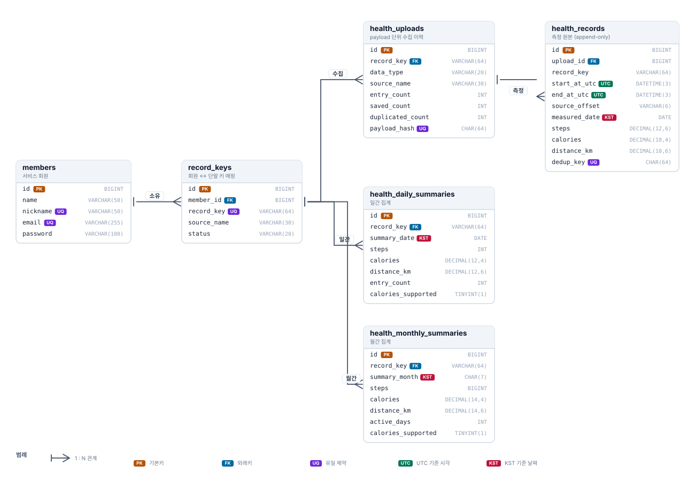

# ERD 및 테이블 정의

> 이 문서의 테이블 정의는 실제 생성된 스키마(`information_schema`)에서 추출했다.
> 설명란은 마이그레이션 파일에 작성한 컬럼 COMMENT 를 그대로 옮긴 것이라 DB 와 항상 일치한다.

## 관계도



> 다이어그램은 `docs/images/erd.svg` 이며, 스키마가 바뀌면 함께 갱신한다.
> 전체 컬럼과 설명은 아래 [테이블 정의](#테이블-정의)에 있다.

## 설계 의도

### 1. 레코드키를 회원 컬럼이 아닌 별도 테이블로 분리

한 회원이 삼성헬스(Android)와 애플 건강(iPhone)을 동시에 쓸 수 있고, 단말을 교체하면
새 recordkey 가 발급되는데 과거 데이터는 이전 키에 남아 있어야 한다.
실제 입력 데이터도 recordkey 4개가 각각 다른 출처(삼성 2 / 애플 2)로 들어온다.

`record_key` 에 전역 UNIQUE 를 두어 같은 키가 두 회원에 매핑되는 것을 막는다.
같은 키가 두 회원에 붙으면 수집 데이터의 주인이 모호해진다.

### 2. 수집 이력(`health_uploads`)과 측정 원본(`health_records`) 분리

payload 하나에 측정 구간 수백~수천 건이 담겨 온다. 이력을 따로 두면

- 같은 payload 가 통째로 재전송될 때 `payload_hash` 로 즉시 판별할 수 있고
- 수신/저장/중복 건수가 남아, 나중에 데이터가 비어 보일 때
  **단말이 안 보낸 것인지 서버가 거른 것인지** 구분할 수 있다.

### 3. `health_records` 는 append-only

한 번 저장하면 수정하지 않으므로 `updated_at` 을 두지 않았다.
수정 시각 컬럼이 있으면 "언젠가 수정될 수 있다"는 잘못된 신호를 준다.

### 4. 시각 컬럼을 세 종류로 구분

| 컬럼 | 기준 | 의미 |
|---|---|---|
| `start_at_utc` / `end_at_utc` | **UTC** | 단말이 측정한 시각 |
| `measured_date` | **KST** | 집계 기준일 |
| `created_at` / `updated_at` | 서버 로컬 | 서버가 저장한 시각 |

두 출처의 시각 표기가 달라 이 구분이 필수다. 삼성은 오프셋 없는 로컬 시각,
애플은 ISO8601 UTC 로 보낸다. 서버는 모두 UTC 로 모으고, 집계는 KST 날짜로 수행한다.
`source_offset` 은 원본에 오프셋이 있었는지를 남겨, 서버가 KST 로 **추정**한 데이터를
나중에 식별할 수 있게 한다.

### 5. 수치 컬럼을 DECIMAL 로

원본에 `0.29999998`, `9.759994` 같은 float32 계산값이 그대로 들어 있고,
애플의 걸음수는 `688.5509846105425` 같은 소수다.
부동소수로 누적하면 원본 합계와 어긋나므로 저장·집계를 DECIMAL 로 수행한다.

일별 집계의 `steps` 만 `INT` 인데, 과제 명세가 `steps int` 이기 때문이다.
**소수 걸음을 모두 더한 뒤 마지막에 한 번만 반올림**한다.

### 6. 중복 차단 키

| 컬럼 | 범위 | 구성 |
|---|---|---|
| `health_uploads.payload_hash` | payload 전체 | recordkey + 출처 + 타입 + 모든 구간 키 |
| `health_records.dedup_key` | 측정 구간 하나 | recordkey + 출처 + 타입 + 측정 구간(UTC) |

`dedup_key` 에 **측정값(걸음수 등)은 넣지 않는다.** 단말이 같은 구간의 값을 보정해
다시 보낼 수 있는데, 값을 키에 포함하면 보정 전후가 서로 다른 측정으로 취급되어 중복 저장된다.

## 테이블 정의

### `members` — 서비스 회원

| 컬럼 | 타입 | Null | 키 | 설명 |
|---|---|---|---|---|
| `id` | `bigint` | N | PK AI | 회원 식별자 |
| `name` | `varchar(50)` | N |  | 회원 이름 |
| `nickname` | `varchar(50)` | N | UQ | 닉네임. 서비스 내 표시 이름이며 중복될 수 없다 |
| `email` | `varchar(255)` | N | UQ | 로그인 ID 로 사용하는 이메일 |
| `password` | `varchar(100)` | N |  | 비밀번호 해시. 평문은 저장하지 않는다. BCrypt 결과 60자에 더해 {bcrypt} 같은 알고리즘 식별자 접두어가 붙을 수 있어 여유를 둔다 |
| `created_at` | `datetime(6)` | N |  | 레코드 생성 시각(서버 저장 시점) |
| `updated_at` | `datetime(6)` | N |  | 레코드 수정 시각(서버 저장 시점) |

### `record_keys` — 회원과 단말 사용자 구분 키(recordkey)의 매핑

| 컬럼 | 타입 | Null | 키 | 설명 |
|---|---|---|---|---|
| `id` | `bigint` | N | PK AI | 레코드키 매핑 식별자 |
| `member_id` | `bigint` | N | IDX | 이 레코드키를 소유한 회원 ID |
| `record_key` | `varchar(64)` | N | UQ | 단말이 전송하는 사용자 구분 키. 입력 데이터에서는 UUID 형식이다 |
| `source_name` | `varchar(30)` | N |  | 데이터 출처. 입력 데이터 기준 SamsungHealth 또는 Health Kit |
| `product_name` | `varchar(50)` | Y |  | 단말 제품명. Android 또는 iPhone |
| `product_vendor` | `varchar(50)` | Y |  | 단말 제조사. Samsung 또는 Apple inc. |
| `status` | `varchar(20)` | N |  | 수집 상태. ACTIVE=수집 대상, INACTIVE=단말 교체 등으로 수집 중단 (기본값 `ACTIVE`) |
| `created_at` | `datetime(6)` | N |  | 레코드 생성 시각(서버 저장 시점) |
| `updated_at` | `datetime(6)` | N |  | 레코드 수정 시각(서버 저장 시점) |

### `health_uploads` — payload 단위 수집 이력

| 컬럼 | 타입 | Null | 키 | 설명 |
|---|---|---|---|---|
| `id` | `bigint` | N | PK AI | 수집 이력 식별자 |
| `record_key` | `varchar(64)` | N | IDX | 수집 대상 사용자 구분 키 |
| `data_type` | `varchar(20)` | N |  | payload 의 type 값. 현재는 steps 만 사용하며 향후 심박/수면 등으로 확장 가능 |
| `source_name` | `varchar(30)` | N |  | 데이터 출처. SamsungHealth 또는 Health Kit |
| `source_mode` | `int` | Y |  | payload 의 source.mode 값. 삼성 9, 애플 10 으로 관측됨 |
| `product_name` | `varchar(50)` | Y |  | 단말 제품명. Android 또는 iPhone |
| `product_vendor` | `varchar(50)` | Y |  | 단말 제조사. Samsung 또는 Apple inc. |
| `memo` | `varchar(255)` | Y |  | payload 의 memo 값. 애플 데이터에만 존재하며 대개 빈 문자열 |
| `last_update_at` | `datetime(3)` | Y |  | payload 의 lastUpdate 를 UTC 로 정규화한 값. 단말이 마지막으로 데이터를 갱신한 시각 |
| `entry_count` | `int` | N |  | 수신한 측정 구간 건수 (기본값 `0`) |
| `saved_count` | `int` | N |  | 실제로 저장된 건수 (기본값 `0`) |
| `duplicated_count` | `int` | N |  | 이미 저장되어 있어 건너뛴 건수(재전송) (기본값 `0`) |
| `failed_count` | `int` | N |  | 형식 오류 등으로 저장하지 못한 건수 (기본값 `0`) |
| `payload_hash` | `char(64)` | N | UQ | payload 전체의 SHA-256. 동일 payload 재전송을 이력 단위에서 식별한다 |
| `created_at` | `datetime(6)` | N |  | 레코드 생성 시각(서버 저장 시점) |
| `updated_at` | `datetime(6)` | N |  | 레코드 수정 시각(서버 저장 시점) |

### `health_records` — 단말에서 수집한 10분 단위 측정 원본 (append-only)

| 컬럼 | 타입 | Null | 키 | 설명 |
|---|---|---|---|---|
| `id` | `bigint` | N | PK AI | 측정 구간 식별자 |
| `upload_id` | `bigint` | N | IDX | 이 데이터가 들어온 수집 이력 ID |
| `record_key` | `varchar(64)` | N | IDX | 사용자 구분 키. 조회 시 조인을 피하기 위해 비정규화해 둔다 |
| `data_type` | `varchar(20)` | N |  | 측정 항목. 현재는 steps |
| `source_name` | `varchar(30)` | N |  | 데이터 출처. 같은 구간이라도 출처가 다르면 별개 데이터로 취급한다 |
| `start_at_utc` | `datetime(3)` | N |  | 측정 구간 시작 시각(UTC 정규화). 삼성은 오프셋이 없어 기기 로컬(KST)로 간주해 변환한다 |
| `end_at_utc` | `datetime(3)` | N |  | 측정 구간 종료 시각(UTC 정규화). 삼성 데이터에는 start 와 동일한 0초 구간이 존재하며 이 또한 유효한 값이다 |
| `source_offset` | `varchar(6)` | Y |  | 원본에 표기된 UTC 오프셋(예: +0000). 오프셋이 없던 데이터는 NULL 로 두어 추정 여부를 구분한다 |
| `measured_date` | `date` | N |  | 집계 기준일(KST). 일별/월별 집계는 항상 이 컬럼을 기준으로 한다 |
| `steps` | `decimal(12,6)` | N |  | 걸음수. 애플 데이터는 구간을 안분한 소수값이 들어오므로 원본을 손실 없이 보존하고 반올림은 집계 시 1회만 수행한다 |
| `calories` | `decimal(10,4)` | N |  | 소모 칼로리(kcal). 애플 HealthKit 은 값을 제공하지 않아 0 으로 들어온다 |
| `distance_km` | `decimal(10,6)` | N |  | 이동거리(km). 원본 단위를 검증한 뒤 km 로 정규화해 저장한다 |
| `dedup_key` | `char(64)` | N | UQ | record_key + source + type + 측정 구간의 SHA-256. 동일 구간 재전송을 차단하는 최종 방어선 |
| `created_at` | `datetime(6)` | N |  | 서버 저장 시각. 측정 시각과 구분된다 |

### `health_daily_summaries` — 레코드키별 일간 활동 집계

| 컬럼 | 타입 | Null | 키 | 설명 |
|---|---|---|---|---|
| `id` | `bigint` | N | PK AI | 일별 집계 식별자 |
| `record_key` | `varchar(64)` | N | IDX | 사용자 구분 키 |
| `summary_date` | `date` | N |  | 집계 기준일(KST). health_records.measured_date 와 같은 기준이다 |
| `steps` | `int` | N |  | 해당 일자의 총 걸음수. 소수 걸음을 모두 더한 뒤 마지막에 한 번만 반올림한다. 구간별로 반올림하면 원본 합계와 어긋난다(실측 기준 하루 최대 4걸음) |
| `calories` | `decimal(12,4)` | N |  | 해당 일자의 총 소모 칼로리(kcal) |
| `distance_km` | `decimal(12,6)` | N |  | 해당 일자의 총 이동거리(km) |
| `entry_count` | `int` | N |  | 집계에 사용된 측정 구간 건수. 데이터 누락 여부를 판단하는 근거가 된다 |
| `calories_supported` | `tinyint(1)` | N |  | 출처가 칼로리를 제공하는지 여부. 애플 HealthKit 은 항상 0 을 보내므로, 활동이 없어서 0 인 것과 값을 제공하지 않아 0 인 것을 구분한다 (기본값 `1`) |
| `last_aggregated_at` | `datetime(6)` | N |  | 마지막으로 집계를 갱신한 시각 |
| `created_at` | `datetime(6)` | N |  | 레코드 생성 시각(서버 저장 시점) |
| `updated_at` | `datetime(6)` | N |  | 레코드 수정 시각(서버 저장 시점) |

### `health_monthly_summaries` — 레코드키별 월간 활동 집계

| 컬럼 | 타입 | Null | 키 | 설명 |
|---|---|---|---|---|
| `id` | `bigint` | N | PK AI | 월별 집계 식별자 |
| `record_key` | `varchar(64)` | N | IDX | 사용자 구분 키 |
| `summary_month` | `char(7)` | N |  | 집계 기준월(KST), YYYY-MM 형식. 문자열 비교만으로 기간 범위 조회가 가능하다 |
| `steps` | `bigint` | N |  | 해당 월의 총 걸음수. 일별 합계를 누적하므로 INT 범위를 넘을 수 있어 BIGINT 로 둔다 |
| `calories` | `decimal(14,4)` | N |  | 해당 월의 총 소모 칼로리(kcal) |
| `distance_km` | `decimal(14,6)` | N |  | 해당 월의 총 이동거리(km) |
| `active_days` | `int` | N |  | 측정 데이터가 존재한 일수. 월 전체 일수와 달라 활동 밀도를 판단하는 근거가 된다 |
| `entry_count` | `int` | N |  | 집계에 사용된 측정 구간 건수 |
| `calories_supported` | `tinyint(1)` | N |  | 출처가 칼로리를 제공하는지 여부 (기본값 `1`) |
| `last_aggregated_at` | `datetime(6)` | N |  | 마지막으로 집계를 갱신한 시각 |
| `created_at` | `datetime(6)` | N |  | 레코드 생성 시각(서버 저장 시점) |
| `updated_at` | `datetime(6)` | N |  | 레코드 수정 시각(서버 저장 시점) |

## 인덱스

| 테이블 | 인덱스 | 용도 |
|---|---|---|
| `members` | `uk_members_email`, `uk_members_nickname` | 로그인, 가입 시 중복 판별 |
| `record_keys` | `uk_record_keys_record_key` | 전역 유일성 |
| | `idx_record_keys_member_id` | 회원의 레코드키 목록 |
| `health_uploads` | `uk_health_uploads_payload_hash` | payload 재전송 판별 |
| | `idx_health_uploads_record_key` | 레코드키별 수집 이력 |
| `health_records` | `uk_health_records_dedup_key` | 구간 재전송 차단(최종 방어선) |
| | `idx_health_records_key_date` | **일별 집계 갱신과 조회** |
| | `idx_health_records_upload_id` | 저장 건수 확인 |
| `health_daily_summaries` | `uk_daily_summaries_key_date` | UPSERT 충돌 판정 + 기간 조회 |
| `health_monthly_summaries` | `uk_monthly_summaries_key_month` | UPSERT 충돌 판정 + 기간 조회 |

## 외래키 정책

```
members ← record_keys ← health_uploads ← health_records
                     ← health_daily_summaries
                     ← health_monthly_summaries
```

`health_records` 에는 `record_key` 외래키를 걸지 않았다.
1회 수집에 최대 1,497건이 배치 INSERT 되는데, 행마다 부모 조회·잠금이 발생하면
수집 성능이 떨어진다. 대신 `upload_id` 외래키로 무결성 체인이 이어져 있어
`health_records → health_uploads → record_keys → members` 로 소유 관계가 보장된다.

집계 테이블은 일/월 단위라 행 수가 적고 UPSERT 빈도도 낮아 `record_key` 외래키를 유지했다.
